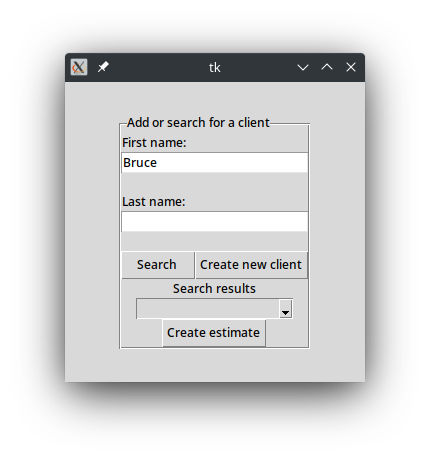
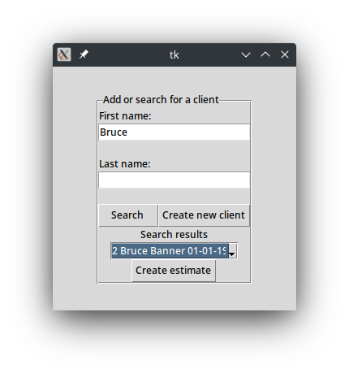
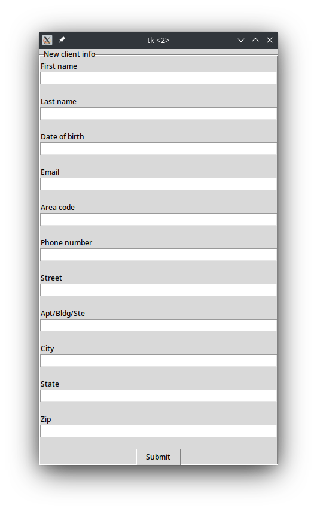
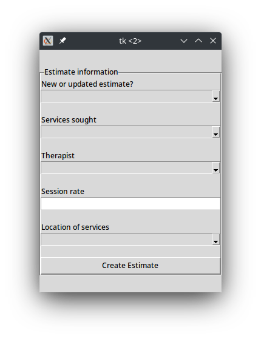

# Table of contents
1. [Purpose](#purpose)
2. [Prerequisites](#prerequisites)
3. [Installation](#installation)
4. [Roadmap](#roadmap)
# Good Faith Estimate Management System





## Purpose <a name="purpose"></a>
The Good Faith Estimate Management System (GFEMS) was designed to enable the non-profit mental health center that I work for to quickly generate Good Faith Estimates (per the No Surprises Act) for potential and current clients. The GFEMS will take a client's info, ask about what services the client is seeking, and then generate a PDF estimate to give to the client, while storing the estimates details in a database. The renewal_checker.py script can be set to run daily and will alert the user to any renewals that are upcoming in the next 30 days.

## Prerequisites <a name="prerequisites"></a>
- Python 3.7+
- Jinja2 3.1.2
- MarkupSafe 2.1.2
- pdfkit 1.0.0
- python-dateutil 2.8.2
- wkhtmltopdf

Besides Python itself, all of the dependencies can be downloaded using pip. The exception is wkhtmltopdf, which is an external program that pdfkit requires to function correctly. You can download wkhtmltopdf here: https://wkhtmltopdf.org/

Additionally, while the Tkinter library usually comes standard in Python, on many Linux distributions I have found that this is not the case. When Tkinter is not included in Python, unfortunately you cannot download it from pip. Instead, please search your distribution's repositories for python3-tk and install it from there.

On Debian based distributions, if Tkinter is missing you should be able to install it using:

```
sudo apt-get install python3-tk
```

On Fedora, if Tkinter is missing you should be able to install it using:

```
sudo dnf install python3-tkinter
```

On Manjaro, its a little different, but you can install Tkinter using:

```
pamac install tk
```

## Installation <a name="installation"></a>

Presently, the GFEMS is not setup for easy installation by other users. You can download the files, create a virtual environment, and install all of the prerequisites (beside wkhtmltopdf as mentioned above) from the requirements.txt file by using:

```
pip install -r requirements.txt
```

Once you activate the virtual environment, you can run the GFEMS by using:

```
python application.py
```

When you first run the GFEMS, it will check to see if a database for storing estimate information is already present and if not, it will ask if you would like the program to create one. The GFEMS will create a sqlite3 database that will work with the program, but you will need to input information specific to your practice before the program will work. This means inputting information about your therapists, the services you offer, and the locations where you offer services into the appropriate sqlite3 tables (named therapists, services, and locations respectively). Once this information has been input into the database, the program should work. By default, the program will store the generated PDFs in the same folder as application.py.

Please note that the GFEMS does not work on Windows without some additional configuration.

## Roadmap <a name="roadmap"></a>
- Create user windows for inputting and editing therapist information, information about services offered, and information about practice location(s) into the database.
- Configure the GFEMS to work on Windows by default (GFEMS currently only works on MacOS and Linux by default).
- Expand the GFEMS to become a potential client record keeping system.
